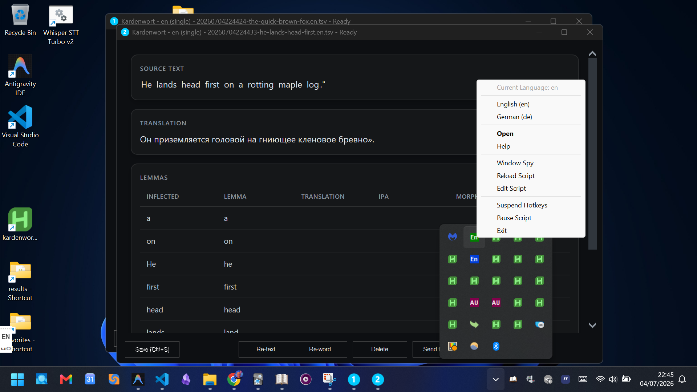
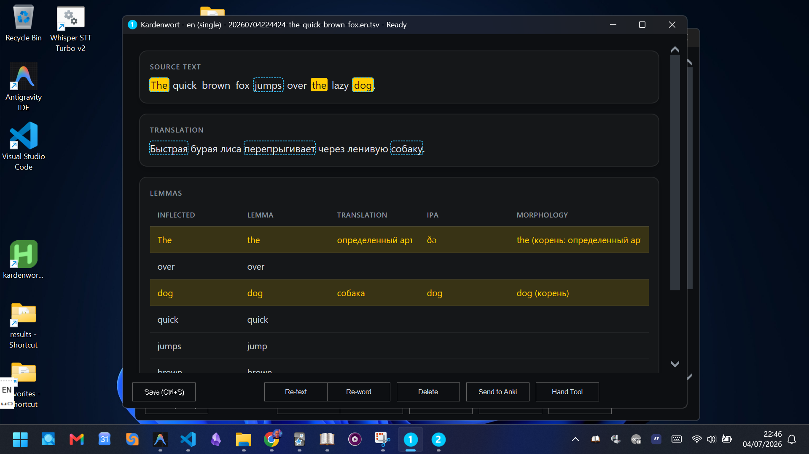
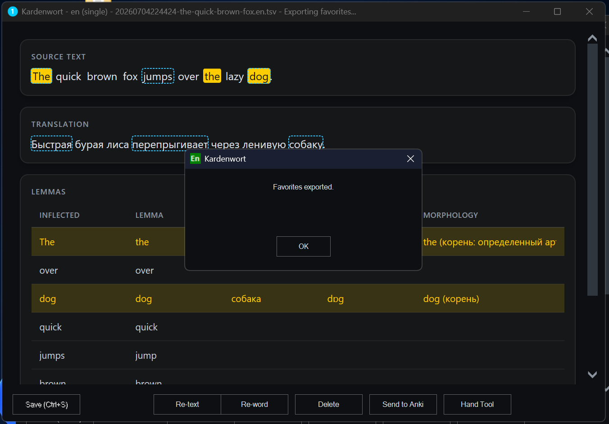
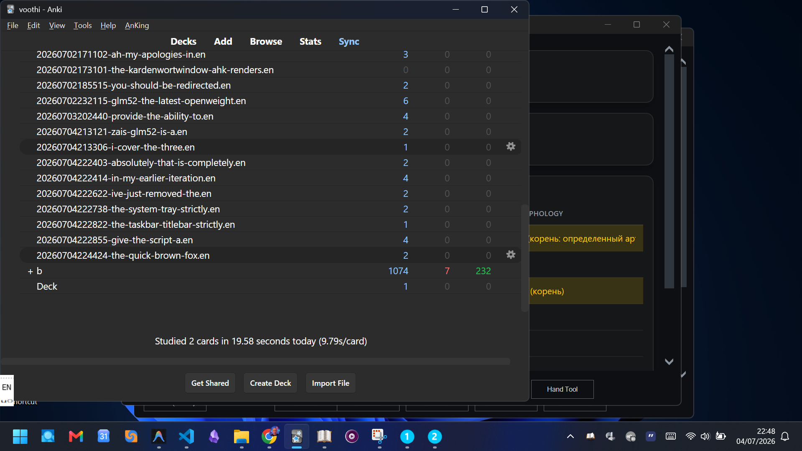
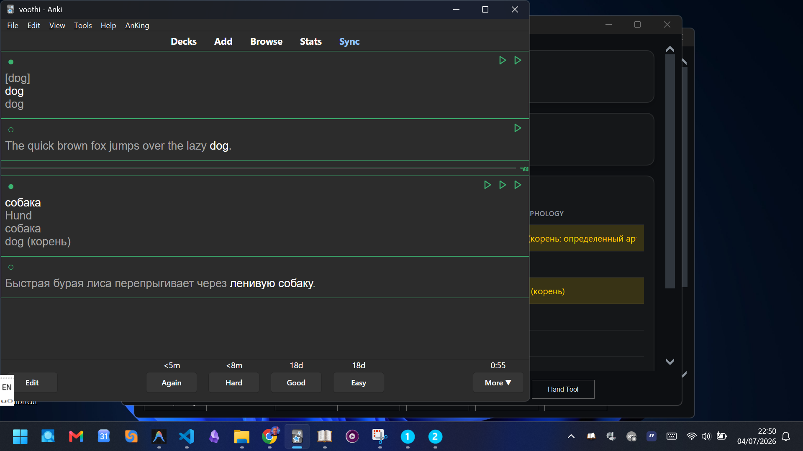
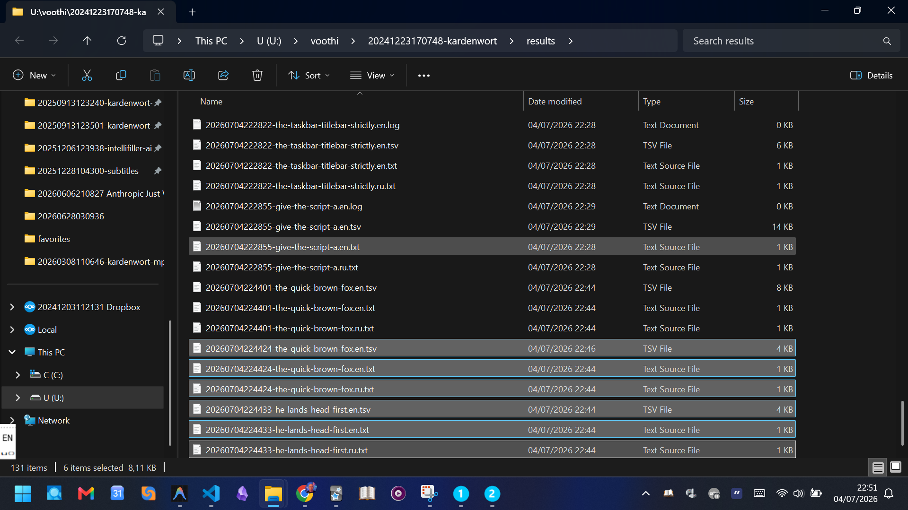
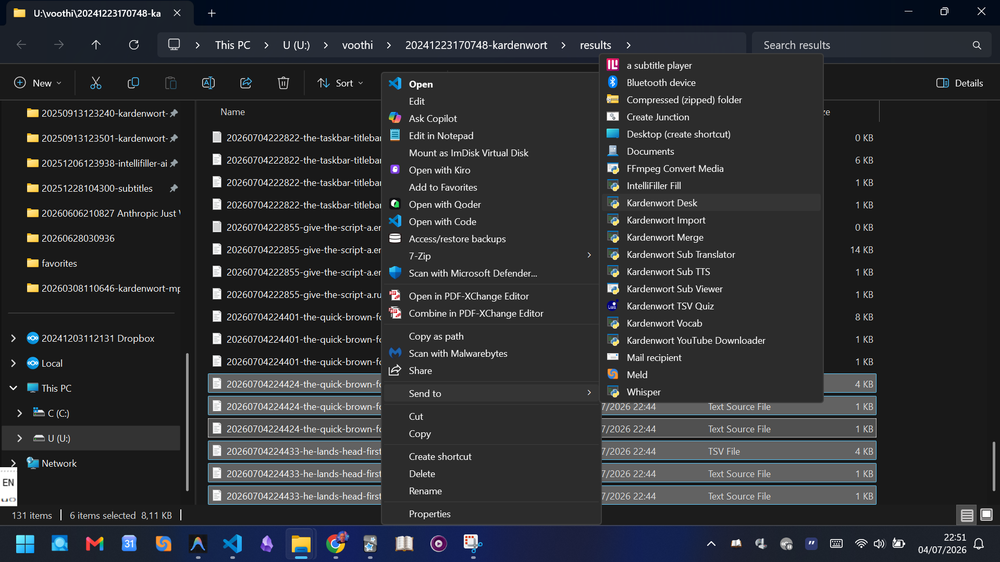
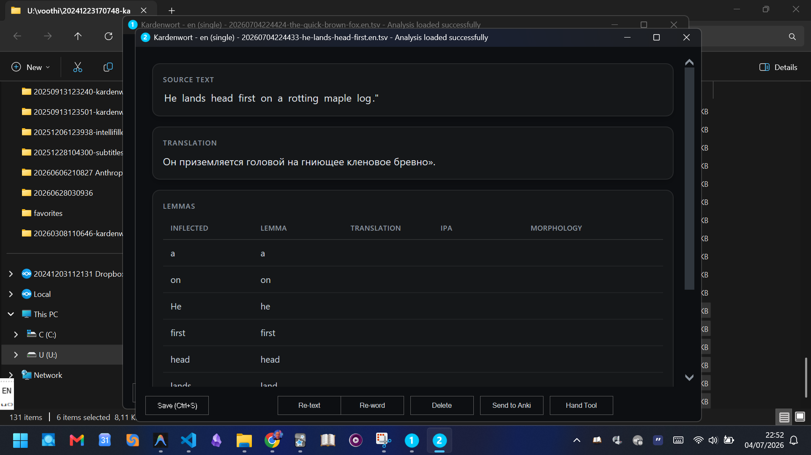

# Kardenwort Desk

[](https://github.com/voothi/20260629183335-kardenwort-desk)
[](https://opensource.org/licenses/MIT)

Python orchestration core for the Kardenwort desktop window. It runs
[kardenwort](../20241223170748-kardenwort) to extract lemmas and sentence
translations, invokes [headless IntelliFiller](../20251206123938-intellifiller-ai-addon-for-anki)
to fill per-lemma translation columns (ru/de/ua/ipa/morphology), composes the
combined HTML view, and exports favorited rows to a kardenwort-schema TSV for
Anki import.

This repo is the **backend** — a *pure orchestration module* (stdlib-only
Python, no GUI/OS dependencies) with a thin CLI wrapper. The **display
frontend** is a per-platform shim; today it is an AutoHotkey v2 script:

> Display frontend (Windows, AHK v2): `U:/voothi/20240411110510-autohotkey`
> script: `kardenwort-window.ahk`

The frontend is display-only: it captures the selected text (via a per-platform
hotkey/intent), renders the HTML this core emits, lets the user mark rows as
favorites / edit cells, and forwards selections/deltas back here. It contains
no linguistic logic.

## Table of Contents

- [Visual Showcase](#visual-showcase)
- [Single Architectural Contract (portability anchor)](#single-architectural-contract-portability-anchor)
- [CLI contract (called by the AHK shell / SendTo)](#cli-contract-called-by-the-ahk-shell--sendto)
- [Configuration (`config.ini`)](#configuration-configini)
- [Dependencies on Sibling Projects](#dependencies-on-sibling-projects)
- [Processing pipeline (file-on-disk, SendTo per-stage)](#processing-pipeline-file-on-disk-sendto-per-stage)
- [Inflection → lemma link & bidirectional selection](#inflection--lemma-link--bidirectional-selection)
- [Multi-session reliability](#multi-session-reliability)
- [TSV merge utility (SendTo "Kardenwort Merge")](#tsv-merge-utility-sendto-kardenwort-merge)
- [Source text saving & session restore](#source-text-saving--session-restore)
- [GoldenDict Integration](#goldendict-integration)
- [Integration Contracts & Formats](#integration-contracts--formats)
- [Hover-highlight MVP (proof-of-concept)](#hover-highlight-mvp-proof-of-concept)
- [Project Structure](#project-structure)
- [Kardenwort Ecosystem](#kardenwort-ecosystem)
- [License and Acknowledgements](#license-and-acknowledgements)

## Visual Showcase

#### **Launch and Language Selection**
I press Ctrl+Alt+Shift+F2 for En.


#### **Bidirectional Link & Bookmarks**
I select words in the Source Text or in the tabular part of the lemmas. A convenient mode of bookmarks (pointers) is supported, which allows you to quickly find the place of a word in translation and back.


#### **Favorites Export**
Favorites are supported, a separate file with highlighted lemmas is created and sent to Anki.


#### **Anki Synchronization**
To Anki A deck is created with the name of the TSV file. You can also download this TSV file yourself via Ctrl+Shift+I in a few clicks.


#### **Added Deck Preview**
This is what the card looks like in Anki from the added deck (file).


#### **Uploads Directory**
This is what the directory with uploads looks like, with files created for each new launch in an open and understandable format, which can be edited and loaded into Anki.


#### **Session Restore**
It is possible to restore a session in Kardenwort Desk (expand your desk) via Sent to.


#### **Cascaded & Numbered Windows**
Supports restoring multiple groups of files in a directory, then these windows open in a cascade, numbered in their Title Bar and Taskbar Icon.


[Return to Top](#table-of-contents)

## Single Architectural Contract (portability anchor)

The boundary between frontend and backend is a **stable, transport-agnostic
contract**: CLI today (argv → stdout), HTTP later (same payloads/responses).
The orchestration logic — tokenizer, TSV, providers, merge, edit-race
prevention — is written once here and never rewritten. Porting to Linux/Mac
reuses this core unchanged (same stdlib); porting to mobile/web wraps the same
module in an HTTP entrypoint. Only the frontend shim (hotkey/intent capture +
HTML rendering) is rewritten per platform.

For command line transport, multi-line payloads (like render mode's HTML output)
are Base64-encoded to avoid shell quoting and UTF-8 encoding issues. This uses the
Base64 transport helper [b64util.py](file:///U:/voothi/20260629183335-kardenwort-desk/b64util.py) on the backend and [Lib/B64Util.ahk](file:///U:/voothi/20240411110510-autohotkey/Lib/B64Util.ahk) on the frontend (mirroring `ftca`'s `s_b64` pattern).

[Return to Top](#table-of-contents)

## CLI contract (called by the AHK shell / SendTo)

Render mode (produces HTML to stdout):

```
python kardenwort_desk.py render --text "<selected>" --language en --zid <session> [--config <path>] [--verbose | --debug]
```

Export mode (writes favorites TSV to the configured output dir):

```
python kardenwort_desk.py export --selection-manifest <path> --language en [--config <path>]
```

Edit-save mode (applies cell-edit deltas to the word TSV, atomic write):

```
python kardenwort_desk.py edit-save --deltas <deltas.json> --zid <session> [--language en] [--config <path>]
```

Merge mode (combines multiple TSV files into one, ordered by ZID):

```
python kardenwort_desk.py merge --files <f1.tsv> <f2.tsv> --target new [--config <path>]
```

Reprocess mode (clears AI fields for selected rows and runs IntelliFiller again):

```
python kardenwort_desk.py reprocess --selection-manifest <path> --language en [--config <path>]
```

Restore mode (opens a .txt or .tsv file and reconstitutes the desk window state):

```
python kardenwort_desk.py restore --file <ZID>-<slug>.txt [--config <path>]
```

All modes accept `--config <path>` (default: `config.ini` next to `kardenwort_desk.py`).
All paths, the favorites output directory, the headless IntelliFiller entrypoint
path, provider slots, and schema mapping are read from `config.ini`.

[Return to Top](#table-of-contents)

## Configuration (`config.ini`)

All sibling-project paths in `config.ini` are **relative, resolved from the
location of this `config.ini`** (mirroring kardenwort's own convention). The
sibling repos all live on the same level under `U:/voothi/`, so they are
referenced via `../`:

```ini
[environment]
; Python interpreter for kardenwort (spacy-env venv)
kardenwort_python = ../20250825231214-spacy-env/Scripts/python.exe
; Kardenwort project (script + data files)
kardenwort_workspace = ../20241223170748-kardenwort
; Deep-translator (Google + DeepL providers)
deep_translator_python = ../20241122093311-deep-translator/venv/Scripts/python.exe
translate_google_script = ../20241122093311-deep-translator/translate_google.py
translate_deepl_script = ../20241122093311-deep-translator/translate_deepl.py
; DeepL API key secrets — point at translate-selection's settings.ini which
; contains [Security] SecretsPath (the actual secrets.ini) + Salt.
; The desk core reads the salt + secrets path from settings.ini, then
; deobfuscates the key (base64+XOR with salt, %%SEC%% marker), mirroring
; translate-selection.ahk's GetDeepLKey pattern.
deepl_settings_file = ../20240411110510-autohotkey/translate-selection/settings.ini
; IntelliFiller headless entrypoint (resolve to the installed entrypoint module)
intellifiller_headless = ../20251206123938-intellifiller-ai-addon-for-anki/IntelliFiller/headless_entrypoint.py

[translation_providers]
; [DEPRECATED] Use [pipeline] section instead.
; Each slot: google | intellifiller | deepl | combined
main_text_translation = combined
lemmas_translation = combined
; Pass --use-local-fork to translate scripts (default: true)
use_local_fork = true

[pipeline]
; The base translation provider (google, deepl)
base_provider = google
; The enrichment provider (intellifiller, none)
enrichment_provider = intellifiller

[triggers]
; Trigger for base translation. Options: auto (on load), manual (user must trigger)
run_base_translation = auto
; Trigger for enrichment. Options: auto (on load), manual (user must trigger)
run_enrichment = manual

[rendering]
; UI rendering mode. Options: progressive (stream stages as ready), monolithic (wait for all stages)
display_mode = progressive

[settings]
default_language = en
default_target_language = ru
; [DEPRECATED] Use [rendering] display_mode instead.
progressive_loading = true
; [DEPRECATED] Use [triggers] instead.
lazy_processing = llm_only
; Favorites TSV output directory (relative or absolute)
favorites_output_dir = ./favorites
; Standalone schema-mapping file (same pattern as kardenwort-mpv's anki-mapping.ini)
; NOTE: kardenwort-mpv's anki-mapping.ini has WordSource=source_word (older mapping);
; the desk core needs col_lemma=WordSource (kardenwort.py's mapping: WordSource=lemma).
; Either point at a desk-local copy with the [desk_columns] section added, or
; update the shared file to add [desk_columns] + [desk_editable].
anki_mapping_file = ./anki-mapping.ini
save_source_text = true
merge_delete_sources = false
; NOTE: file_watcher_interval_ms is a display concern and lives in the AHK-side
; config.ini [Settings] section (FileWatcherIntervalMs), not here.

[languages]
; per-language lemma data files (under kardenwort_workspace) + IntelliFiller prompt names
en_lemma_index = data/en/en-news-2023-1m-words.csv
en_lemma_override = data/en/lemma_override_en.tsv
en_prompt = English Vocabulary Analysis and Translation JSON
de_lemma_index = data/de/deu-mixed-typical-2011-1m-words.csv
de_lemma_override = data/de/lemma_override_de.tsv
de_prompt = <TBD>

[timeouts]
; Subprocess timeout in seconds (kills the subprocess on expiry; never hangs)
translation_timeout = 60
intellifiller_timeout = 120
```

Paths are validated at startup; a missing path produces a clear error naming
the offending key.

[Return to Top](#table-of-contents)

## Dependencies on Sibling Projects

This orchestration core coordinates and depends on several sister projects within the Kardenwort ecosystem:

1. **Kardenwort Parser (`U:/voothi/20241223170748-kardenwort`)**
   - **Role**: Core linguistic engine.
   - **Dependency**: The desk core calls `kardenwort.py` in a subprocess to run morphological parsing, tokenization, lemma analysis, and generation of the initial lemmatized HTML structure.

2. **IntelliFiller (`U:/voothi/20251206123938-intellifiller-ai-addon-for-anki`)**
   - **Role**: Headless LLM translation and details enrichment.
   - **Dependency**: Called in Stage 2/Export to query LLMs and fill localized vocabulary parameters (e.g. IPA, transcription, translation variants, morphology) directly into the generated TSV schema.

3. **AutoHotkey Frontend (`U:/voothi/20240411110510-autohotkey`)**
   - **Role**: User Interface and Interaction shim.
   - **Dependency**: Provides the physical desktop interface (`kardenwort-window.ahk`). Captures system text selections, hosts the WebView component to render the desk core's HTML outputs, coordinates inline grid edits, and manages the sequence number cascade.

4. **Deep-Translator (`U:/voothi/20241122093311-deep-translator`)**
   - **Role**: Translation services broker.
   - **Dependency**: Provides the backend integration script (`translate_google.py`, `translate_deepl.py`) used by the pipeline to fetch baseline target translations of the selection block.

[Return to Top](#table-of-contents)

## Processing pipeline (file-on-disk, SendTo per-stage)

Each stage operates on files on disk and is independently re-runnable via
Windows SendTo. **All state between stages is carried exclusively by the
standard kardenwort TSV/JSON files** (schema from `kardenwort.py` +
`config.ini [anki_fields]`) — no hidden/in-memory state crosses a stage
boundary. Pipeline composition (which stages run, in which order) is
config-driven, so the final Anki import can be dropped (e.g.
`stages = extract, fill`) leaving the filled TSV+JSON on disk. If Import
fails, the files remain on disk for a manual retry via SendTo.

```
Stage 1   Extract   (kardenwort)        .txt/.srt → triple.word.<lang>.tsv (+ .json)
Stage 1b  Edit      (desk window)       inline Excel-like cell editing → atomic save of the word TSV
Stage 2   Fill      (headless IntelliFiller)  word TSV → columns filled in place
Stage 3   Import    (kardenwort_runner --import-only)  filled TSV + .json → Anki
```

This core (kardenwort-desk) drives the same stages for the live window, and
its "export favorites" produces a TSV that re-enters at Stage 2 or 3. Inline
lemma/translation edits are held in-memory until an explicit Save (button /
Ctrl+S), then written atomically by this core so a crash never corrupts the
TSV.

[Return to Top](#table-of-contents)

## Inflection → lemma link & bidirectional selection

The core tokenizes the original text (Python port of the kardenwort-mpv
tokenizer) and exposes a token→lemma map derived from kardenwort's
`Quotation`/`WordSource`/`WordSourceInflectedForm` columns. The window uses
this for **bidirectional selection**: selecting word(s) in the original text
highlights the corresponding lemma row(s) in the table, and vice versa.

The lemma table is **frequency-ordered** (most frequent lemma first, per the
language's `--lemma-index-file`).

Desk window layout:
```
Original text.                       ← tokenized, selectable
Translation of the original text.    ← sentence translation
Table with lemmas and their translation.  ← frequency-ordered, editable, bidirectional link
```

[Return to Top](#table-of-contents)

## Multi-session reliability

Many desk windows can run simultaneously, each with its own text and
independent save/close lifecycle — they never conflict. Each window session
gets a unique **ZID** (14-digit timestamp + process-unique suffix if needed);
its working TSV is ZID-prefixed, so two windows never write the same file.
All TSV writes are **atomic** (temp → backup-rename → atomic promote →
rollback-on-failure, per kardenwort-quiz's `save_tsv`), and an stdlib
**advisory file lock** guards the rare same-file case. The session ZID is the
end-to-end trace key across window, working TSV, temp/backup files, and logs.

[Return to Top](#table-of-contents)

## TSV merge utility (SendTo "Kardenwort Merge")

Combines multiple selected `triple.word.<lang>.tsv` files into one, ordered by
**ZID (timestamp)** — for grouping parts/individual files into one logically
complete study unit (easier to study). Installed via `install.py` as a SendTo
entrypoint.

Merge target options:
- **Create new** (default): `<current-ZID>-merged.<lang>.tsv`
- **Append to first**: earliest-ZID file becomes the target
- **Append to chosen**: pick the target from a dropdown in the desk window

Source files are kept by default (non-destructive); `merge_delete_sources`
in config enables deletion after a verified merge. The merged file is written
atomically; mismatched schemas are refused.

[Return to Top](#table-of-contents)

## Source text saving & session restore

When a session produces its working TSV, the desk core also saves the original
source text as a `.txt` file with the **same ZID prefix**
(`<ZID>-<slug>.txt` next to `<ZID>-<slug>.<lang>.tsv`). This is gated by config
option `save_source_text` (default: enabled).

The **"Kardenwort Desk Restore"** SendTo entrypoint (via `install.py`) opens
a `.txt` or `.tsv` file, finds its sibling (same ZID prefix, other extension),
and reconstitutes the desk window's working state (source text + lemma table +
translations + edit state) for continued work. If the sibling file is missing,
it opens with what's available and warns.

[Return to Top](#table-of-contents)

## GoldenDict Integration

Kardenwort Desk provides a `lookup` subcommand that integrates directly with GoldenDict as an external program. It extracts, translates, and formats the given text on the fly.

### Configuration
The `[goldendict]` section in `config.ini` controls the lookup behavior:
- `lookup_ttl_seconds = 3600`: How long to cache lookups (based on a SHA1 hash of the input text). The cache file is saved as `lookup-<lang>-<hash>.tsv` in the configured `generated_results_dir`.
- `run_intellifiller = false`: Whether to run Headless IntelliFiller to populate IPA and Morphology. Enabling this adds significant latency but provides richer data.
- `sections = source,translation,lemmas`: Comma-separated list of sections to render in order.
- `heading_source = Source Text`: Heading label for the source text section.
- `lemma_columns = inflected,lemma,ipa,morphology,translation`: Columns to include in the lemma table.

### GoldenDict Program Setup
Add these command lines as "Programs" in GoldenDict (Edit > Dictionaries > Programs).

**English (HTML format, dark theme):**
```bash
python "U:/voothi/20260629183335-kardenwort-desk/kardenwort_desk.py" lookup --text "%GDWORD%" --language en --format html --theme dark
```
*(This replaces the current `En kW` program)*

**English (Plain Text format):**
```bash
python "U:/voothi/20260629183335-kardenwort-desk/kardenwort_desk.py" lookup --text "%GDWORD%" --language en --format text
```
*(This replaces the current `dT-g En-Ru` text program)*

**German (Combined format, light theme):**
```bash
python "U:/voothi/20260629183335-kardenwort-desk/kardenwort_desk.py" lookup --text "%GDWORD%" --language de --format combined --theme light
```
*(This replaces the current German program)*

### Cache and Latency
The `lookup-<lang>-<hash>.tsv` cache files are stored in your `generated_results_dir`. They skip the extraction and provider lookup phases completely if the requested text hits the cache (TTL expires after `lookup_ttl_seconds`). You can clear the cache by deleting these files. Setting `run_intellifiller = true` will synchronously block the lookup until IntelliFiller completes, which can add a few seconds of latency; consider keeping it `false` for instant lookups if IPA/morphology are not strictly needed.

### Migration Note
If you encounter issues with the new `lookup` command, the revert path is to swap the GoldenDict Program commands back to their previous raw scripts (`En kW`, `dT-g En-Ru`, or German scripts). The desk change is strictly additive and doesn't break or replace the underlying standalone extraction scripts.

[Return to Top](#table-of-contents)

## Integration Contracts & Formats

### 1. Desk Core ↔ Headless IntelliFiller Contract (Task 2.2)
Headless IntelliFiller is executed as:
```bash
python <intellifiller_headless> --tsv <tsv_path> --prompt <prompt_name>
```
- **Inputs**: A word TSV containing vocabulary at `<tsv_path>` and the prompt name (e.g. `English Vocabulary Analysis and Translation JSON`).
- **Outputs**: Headless IntelliFiller updates the columns (e.g. `WordSourceMorphologyAI`, `WordSourceIPA`, `WordDestination`) in-place.

### 2. Desk Core ↔ Kardenwort Invocation (Task 2.3)
`kardenwort.py` is invoked as:
```bash
python <kardenwort_workspace>/src/kardenwort/core/kardenwort.py --type word --stdout-format html --text <text> --lemma-index-file <lemma_index> --lemma-override-file <lemma_override> --sentence-context-size 0
```
- **Inputs**: Selected text, target language index and overrides.
- **Outputs**:
  - HTML content printed to stdout (containing lemmatized spans).
  - A TSV file (`<ZID>-<slug>.<lang>.tsv`) and optional JSON metadata produced via `--output-file`.

### 3. Selection Manifest format (Task 2.4)
For exporting favorites, the frontend creates a JSON file containing the selected row indices/lemma mappings:
```json
{
  "tsv_path": "U:/voothi/...",
  "selected_lemma_ids": ["lemma1", "lemma2"]
}
```
The desk core reads this manifest, extracts the matching lines from the session's working TSV, and outputs a subset TSV into the favorites directory.

[Return to Top](#table-of-contents)

## Hover-highlight MVP (proof-of-concept)

This is an opt-in, client-side-only proof of concept to validate bidirectional word hover highlighting and click bookmarks before adopting the full server-side tokenization and theme-color integration.

### Configuration
In `kardenwort-window/config.ini`, under `[Settings]`:
- `HoverHighlightMvp = 1` (default `0`) — Enables the WebView overlay injection. Set to `0` to completely disable and revert to standard rendering.
- `HoverHighlightMvpBookmarks = N` (default `3`) — The capacity of the rotating bookmark click-to-pin ring buffer.

### Interaction Model
- **Word Hover**: Hovering over a word in either the source text or the translation block will highlight matching tokens on the other side using **cyan** (`#39c5ff` on dark/white themes, `#0969da` on light themes).
- **Word Bookmark Pin**: Clicking a word pins it with an **amber** highlight (`#f0883e` dark, `#bf8700` light). Up to `N` bookmarks can be active; the `N+1`-th click evicts the oldest pin. Clicking a pinned word unpins it.
- **Escape Key**: Pressing `Esc` clears all currently pinned bookmarks.

### Known Limitations (MVP Overlay)
- **Tokenization Drift**: Client-side JavaScript tokenization using a simple regex (`\p{L}`) may occasionally drift from the desk's server-side `text_tokenizer.py` on exotic Unicode boundaries.
- **Fixed Colors**: Unlike the main plan which supports dynamic themes via `theme_colors` from the desk, this MVP uses fixed cyan/amber colors with branches on dark/light/white `body` classes.

### Retirement
This MVP overlay is designed as a host-side overlay. When the full `20260702154120-translation-source-highlight` change is implemented, you can retire this MVP by setting `HoverHighlightMvp = 0` in `config.ini`. No code reverts are needed on the backend.

[Return to Top](#table-of-contents)

## Project Structure

```text
.
├── .agent/                 # Agentic configurations and workflows
├── docs/                   # Documentation and conversation logs
├── kardenwort_desk.py      # Main CLI entrypoint
├── b64util.py              # Base64 transport utility
├── requirements.txt        # Python dependencies
├── config.ini.template     # Configuration template
└── README.md               # Project documentation
```

[Return to Top](#table-of-contents)

## Kardenwort Ecosystem

This project is part of the **[Kardenwort](https://github.com/kardenwort)** environment, designed to create a focused and efficient learning ecosystem.

[Return to Top](#table-of-contents)

## License and Acknowledgements

This project was created by and is maintained by **Denis Novikov (voothi)**.

It is licensed under the **MIT License**. See the `LICENSE` file for details.

[Return to Top](#table-of-contents)
